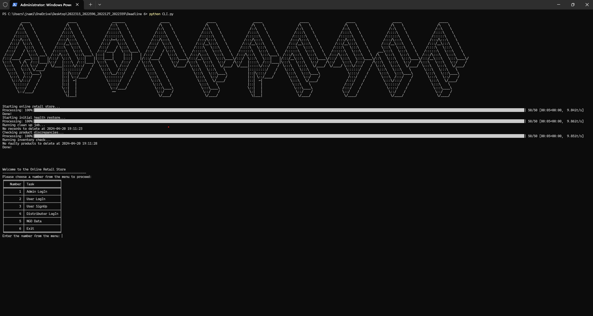
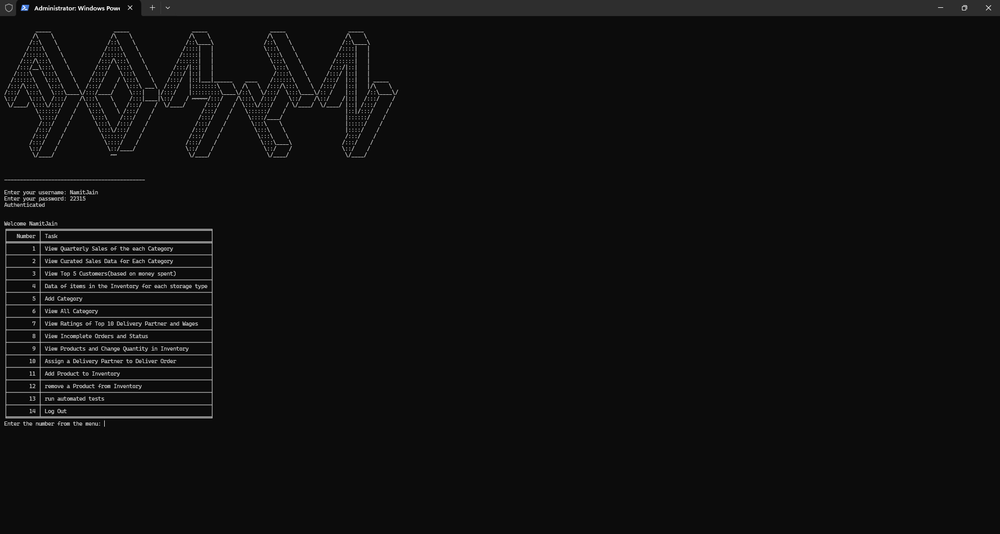
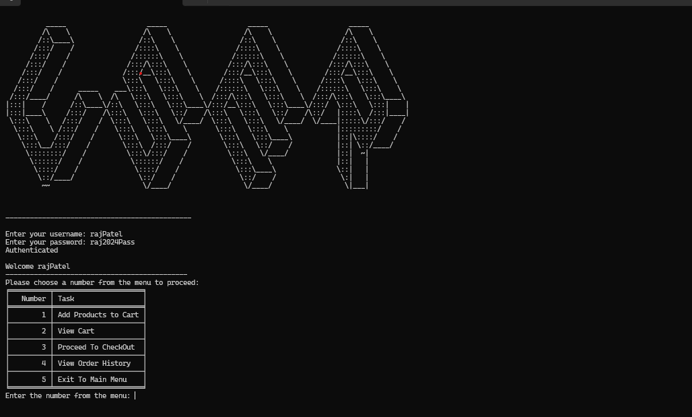
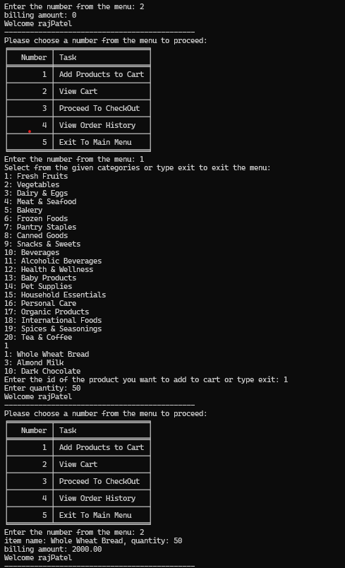
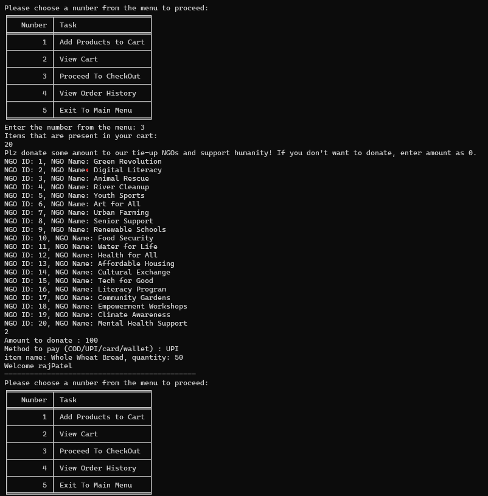
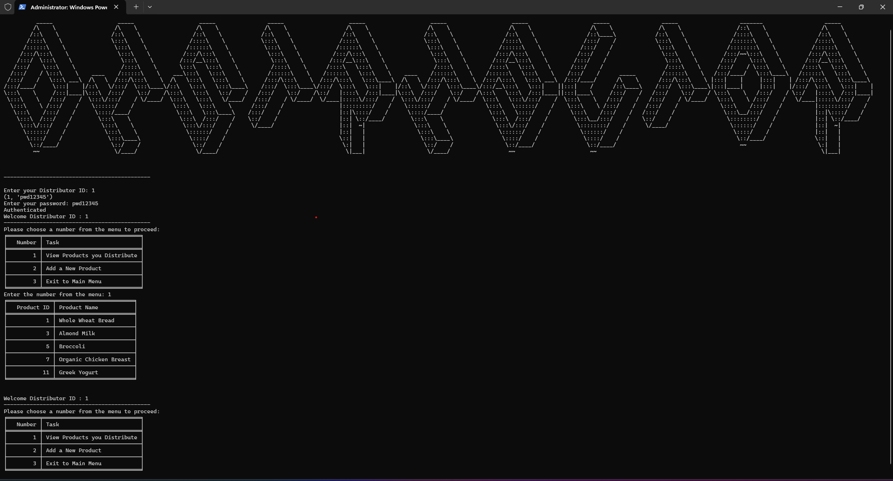

# Online Retail Store Management System

This Python program is a command-line interface (CLI) for an online retail store management system. It allows administrators, customers, distributors, and NGOs to perform various tasks related to the store's operations.

## Functionality

### Admin Functionalities

1. **View Quarterly Sales of Each Category**: Provides sales data for each product category on a quarterly basis.
2. **View Curated Sales Data for Each Category**: Displays curated sales data for each product category.
3. **View Top 5 Customers (based on money spent)**: Lists the top 5 customers based on their total spending.
4. **Data of Items in the Inventory for Each Storage Type**: Shows the inventory items categorized by storage type.
5. **Add Category**: Allows adding a new product category.
6. **View All Categories**: Displays all available product categories.
7. **View Ratings of Top 10 Delivery Partners and Wages**: Shows the ratings and wages of the top 10 delivery partners.
8. **View Incomplete Orders and Status**: Lists all incomplete orders and their current status.
9. **View Products and Change Quantity in Inventory**: Displays products and allows modifying their quantities in the inventory.
10. **Assign a Delivery Partner to Deliver Order**: Assigns a delivery partner to an order.
11. **Add Product to Inventory**: Adds a new product to the inventory.
12. **Remove a Product from Inventory**: Removes a product from the inventory.
13. **Run Automated Tests**: Runs automated tests for the inventory and order management system.

### Customer Functionalities

1. **Add Products to Cart**: Allows customers to browse and add products to their shopping cart.
2. **View Cart**: Displays the contents of the customer's shopping cart.
3. **Proceed to Checkout**: Initiates the checkout process for the customer's order, including payment and donation options.
4. **View Order History**: Shows the customer's order history and status.

### Distributor Functionalities

1. **View Products You Distribute**: Lists the products that a distributor is responsible for distributing.
2. **Add a New Product**: Allows a distributor to add a new product to their distribution list.

### NGO Data

Displays information about the NGOs associated with the online retail store, including their IDs, names, registration numbers, and funds raised.


## Contributing

1. Vipul Mishra
2. Namit Jain
3. Ayush Singhal


## Installation

1. Clone the repository:

```
git clone https://github.com/namit22315/ONLINE-STORE-MANAGEMENT.git
```

2. Install the required dependencies:

```
pip install mysql.connector tabulate tqdm
```

3. Set up the database:
   - Create a MySQL database named `online retail store`.
   - Import the provided SQL schema to create the necessary tables.

4. Update the database connection details in `CLI.py`:

```python
cnx = mysql.connector.connect(user='your_username', password='your_password', host='localhost', port='3306', database='online retail store')
```

## Usage

1. Navigate to the project directory:

```
cd ONLINE-STORE-MANAGEMENT
```

2. Run the main script:

```
python CLI.py
```

3. Follow the on-screen instructions to interact with the CLI menu and perform various tasks.


## Code Structure

- `CLI.py`: The main script that runs the command-line interface.
- `Admin/`: Directory containing modules for various admin functionalities.
- `order_fixer.py`: Module for managing and fixing orders.
- `check_products.py`: Module for checking and validating products.

## Documentation

For detailed documentation on the code structure, functions, and their usage, please refer to the docstrings and comments within the source code files.

## Acknowledgments

- [mysql.connector](https://dev.mysql.com/doc/connector-python/en/) - MySQL driver for Python
- [tabulate](https://pypi.org/project/tabulate/) - Library for pretty-printing tabular data
- [tqdm](https://pypi.org/project/tqdm/) - Library for creating progress bars

## Github Link
https://github.com/namit22315/ONLINE-STORE-MANAGEMENT


## Screenshots

Here are some screenshots of the interface:

### Main Menu


### Admin Login


### User menu


### User Cart and product categories


### Payment Screen


### Distibutor Menu



